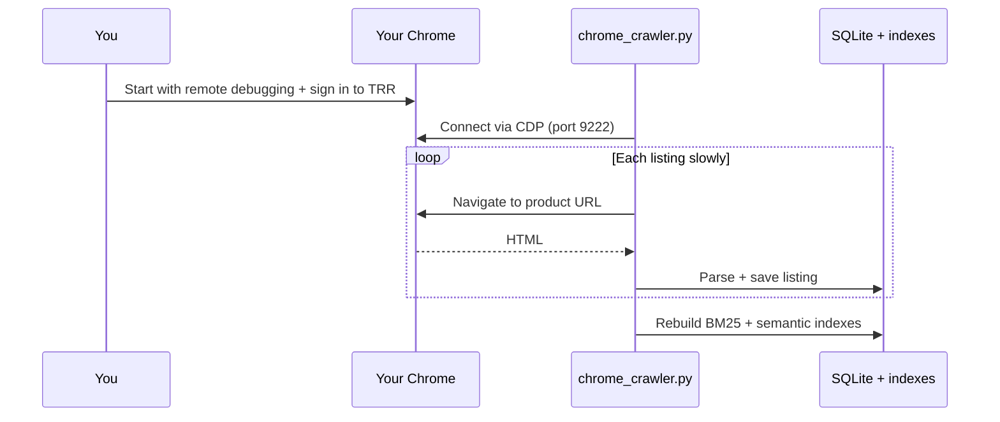

# Chrome CDP crawler (recommended)

This approach controls **your real Google Chrome** — the same browser where you sign in with Google — instead of launching a separate automated browser that TRR often blocks.

## How it works



1. Chrome runs with **remote debugging** (port 9222).
2. You are **already logged in** to The RealReal (Google SSO works normally).
3. `chrome_crawler.py` attaches to Chrome, visits listing pages **slowly**, saves HTML, parses listings, and indexes them.

## Setup

### 1. Install deps (same as main app)

```bash
pip install -r requirements.txt
```

### 2. Start Chrome (macOS example)

**Quit Chrome completely** (Cmd+Q), then:

```bash
chmod +x scripts/start_chrome_debug.sh
./scripts/start_chrome_debug.sh
```

Or manually:

```bash
/Applications/Google\ Chrome.app/Contents/MacOS/Google\ Chrome \
  --remote-debugging-port=9222 \
  --user-data-dir="$HOME/Library/Application Support/Google/Chrome"
```

### 3. Sign in to The RealReal

In that Chrome window, open https://www.therealreal.com/ and sign in (Google is fine).

Browse to a category with products (e.g. New Arrivals) so the crawler can discover URLs.

### 4. Run the crawler

```bash
PYTHONPATH=. python chrome_crawler.py
```

Or from the web UI: **Scrape via my Chrome**.

## Configuration (`.env`)

```bash
CHROME_CDP_URL=http://127.0.0.1:9222
CHROME_CRAWL_MAX_LISTINGS=40
CHROME_CRAWL_DELAY_MIN_MS=4000
CHROME_CRAWL_DELAY_MAX_MS=9000
SCRAPE_LIST_URL=https://www.therealreal.com/sales/shop-new-arrivals-5753
```

## Troubleshooting

| Problem | Fix |
|---------|-----|
| `Cannot reach Chrome at 127.0.0.1:9222` | Run `start_chrome_debug.sh` after quitting Chrome |
| `no_product_urls_found` | Sign in, open a sale/category page with product grids |
| `parse_failed` | Open that product URL manually in Chrome to confirm it loads |
| Chrome already running | Fully quit Chrome, then use the debug script |

Saved HTML: `data/html_snapshots/{product-id}.html`

## vs Playwright scrape

| | Playwright scrape | Chrome CDP |
|--|-------------------|------------|
| Browser | New headless/headed Chromium | **Your Chrome** |
| Login | Automated wait | **You sign in normally** |
| Bot risk | High | Lower (real profile) |
