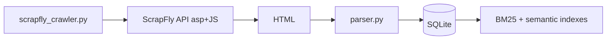

# ScrapFly integration

ScrapFly fetches The RealReal pages in the cloud (PerimeterX bypass, residential proxies, JS rendering). Parsed listings go into the same SQLite DB and search indexes as Chrome CDP / Playwright.

## 1. Get an API key

1. Sign up: https://scrapfly.io/register (free tier includes ~1,000 credits).
2. Copy your API key from https://scrapfly.io/dashboard

## 2. Configure `.env`

```env
SCRAPFLY_API_KEY=scp-live-your-key-here
SCRAPFLY_COUNTRY=us
SCRAPFLY_ASP=true
SCRAPFLY_RENDER_JS=true
SCRAPFLY_PROXY_POOL=public_residential_pool
SCRAPFLY_AUTO_SCROLL=true
SCRAPFLY_COST_BUDGET=50
SCRAPFLY_MAX_LISTINGS=40
SCRAPFLY_DELAY_SECONDS=2
SCRAPFLY_SESSION=trr-scrape
SCRAPFLY_USE_COOKIES_FILE=true
```

Optional: export cookies from your browser to `data/trr_cookies.json` (same file as Playwright login) so ScrapFly sees a logged-in session.

## 3. Install dependency

```bash
pip install -r requirements.txt
```

## 4. Run a crawl

**CLI:**

```bash
PYTHONPATH=. python scrapfly_crawler.py
```

**Web UI:** click **Scrape via ScrapFly** on http://localhost:8000

**API:**

```bash
curl -X POST http://localhost:8000/api/scrape/scrapfly
```

## How it works



1. Fetches category URLs from `SCRAPE_LIST_URL` (with `auto_scroll`).
2. Extracts product links from HTML.
3. Fetches each product page via ScrapFly.
4. Parses with `backend/app/chrome_bridge/parser.py`.
5. Saves listings and rebuilds indexes.

## Cost

Roughly **30–40 API credits per page** with ASP + residential + JS. A full run (3 categories + 40 products) is about **1,300–1,700 credits** (~$0.20 on the Discovery plan). See prior cost discussion or ScrapFly dashboard logs (`X-Scrapfly-Api-Cost`).

## Login / cookies

ScrapFly does not open your Google sign-in UI. For member-only inventory:

1. Sign in to TRR in your normal browser.
2. Export cookies (EditThisCookie, etc.) to `data/trr_cookies.json`.
3. Keep `SCRAPFLY_USE_COOKIES_FILE=true`.

## vs Chrome CDP

| | ScrapFly | Chrome passive |
|--|----------|----------------|
| Local Chrome | No | Yes |
| PerimeterX | Usually handled by ScrapFly | You solve captcha |
| Login | Cookie file | Natural in browser |
| Cost | API credits | Free |

## Troubleshooting

| Issue | Fix |
|-------|-----|
| `Set SCRAPFLY_API_KEY` | Add key to `.env`, restart `python run.py` |
| `no_product_urls_found` | Check category URL; increase `SCRAPFLY_COST_BUDGET` |
| `parse_failed` | Page may be login wall — add `trr_cookies.json` |
| High cost | Lower `SCRAPFLY_MAX_LISTINGS`; enable ScrapFly cache in dashboard |

## Code layout

- `backend/app/scrapfly_bridge/client.py` — single-page fetch
- `backend/app/scrapfly_bridge/crawler.py` — discover + crawl loop
- `backend/app/scraper/service.py` — `scrape_via_scrapfly()`
- `POST /api/scrape/scrapfly` — UI/API entry
